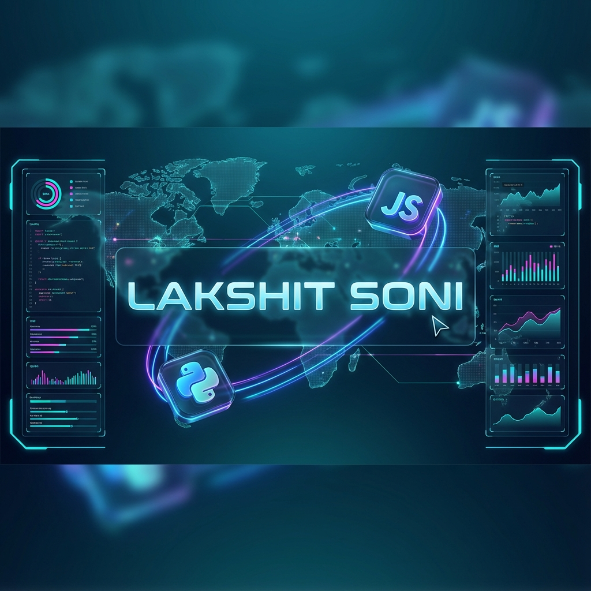

<div align="center">
        
    <br/>
    <br/>
    <a href="https://git.io/typing-svg"></a>
</div>

<div align="center">
    <a href="https://linkedin.com/in/lakshit-soni26"></a>
    <a href="https://lakshit-soni.vercel.app"></a>
    <a href="https://x.com/Lakshit_sonii"></a>
    <a href="mailto:lakshitsoni26@gmail.com"></a>
</div>

<div align="center">
    <a href="https://user-badge.committers.top/india/lakshitsoni26"></a>
</div>

## 👻 A little about me... 

I am a **Full-Stack & Software Engineer** with a special bias towards creativity and innovation. My actions are always aimed at achieving high results and quality fulfillment of tasks. In life I am guided by self-development, I never stand still.

- 🔭 I’m currently working on [Backend for course selling app](https://github.com/lakshitsoni26/backend-course-selling)
- 🌱 I’m currently learning **DSA with Java**
- 👯 I’m looking to collaborate on [Medichain](https://github.com/ssid18/MediChain)
- 👨‍💻 All of my projects are available at [https://github.com/lakshitsoni26](https://github.com/lakshitsoni26)

Currently I am engaged in the development of open-source projects and specialized in creating websites, applications, and backend systems.

```javascript
const LakshitSoni = {
    OS: ["macOS", "Linux"],
    languages: {
        highLevel: ["Java", "JavaScript", "SQL"],
        averageLevel: ["Python", "C++"],
        baseLevel: ["Rust", "TypeScript", "Bash"]
    },
    programming: {
        backend: ["Node.js", "Express.js", "Django", "FastAPI"],
        frontend: ["React.js", "HTML5", "CSS3", "SCSS"],
        databases: ["MongoDB", "PostgreSQL", "MySQL", "SQLite"],
        devOps: ["Docker", "AWS", "Nginx"],
        tools: ["Git", "Postman", "Figma", "Photoshop"]
    },
};
```

## 🏢 My Organizations (Clickable)

<div align="center">
<table>
<tr>
<td><a href="https://github.com/lakshitsoni26"></a></td>
<td><a href="https://github.com/lakshitsoni26"></a></td>
</tr>
</table>
</div>

> [!TIP]
> Use the sidebar to explore my specialized repositories and open-source contributions.

## ☕ Support Me
If you would like to support my journey as an engineer, feel free to connect or buy me a coffee!

| CryptoCurrencies | Address                                        |
| ------------ | -------------------------------------------------- |
| **Ethereum** | `0xPlaceYourMetaMaskAddressHere`                   |
| **Bitcoin**  | `1PlaceYourBitcoinAddressHere`                     |

<details open>
<summary><h3>🐍 Contribution Snake | 🐢</h3></summary>
<div align="center">
  
</div>
</details>

<details open>
<summary><h3>📊 Statistics | 📈</h3></summary>
    
    
	<div align="center">
	    
	    
	</div>
</details>

<div align="center">
<br/>

</div>
