<div align="center">

<table>
<tr>
<td valign="top"></td>
<td valign="top"></td>
</tr>
</table>

<br>

<h2>Lakshit Soni</h2>

**Fullstack Developer · Open Source Enthusiast · Competitive Programmer**

<br>

[](https://lakshit-soni.vercel.app/)
[](https://linkedin.com/in/lakshitsoni26)
[](https://twitter.com/Lakshit_sonii)

</div>

<br/>

<div align="center">
  <h3>🎯 My Skills</h3>
  
  <br/><br/>
  
</div>

<br>

## My Lifecycle


```kotlin
fun main() {
    while (Alive) {
        code()
        fixBugs()
        learningDSA()
        sleep()
        repeat()
    }
}
```

<br>

<details open>
<summary><h3>🐍 Contribution Snake | 🐢</h3></summary>
<div align="center">
  
</div>
</details>

<br>

<!--
<details open>
  <summary><b>📊 My Coding Activity</b></summary>
  START_SECTION:waka
  END_SECTION:waka
</details>
-->

<br>

<!--
## 🎖️ My Statistics:
<h3>Coding Time:</h3>

-->

<details open><summary>Show All Statistics</summary>

<!-- GitHub Trophies (commented out — service is currently down, uncomment when github-profile-trophy.vercel.app is back online)
<h3>GitHub Trophies:</h3>

-->

<div align="center">
  <a href="https://github.com/lakshitsoni26/github-stats">
    
  </a>
  <a href="https://github.com/lakshitsoni26/github-stats">
    
  </a>
</div>
<br>

<div align="center">
  <h3>My Streak:</h3>
  
</div>

</details>

<br>

<div align="center">
<br/>

<br/><br/>
<a href="https://www.buymeacoffee.com/lakshitsoni">
  
</a>

<br/><br/>
  
  <br/>
  <h3>Thanks for visiting! 🚀</h3>
</div>
